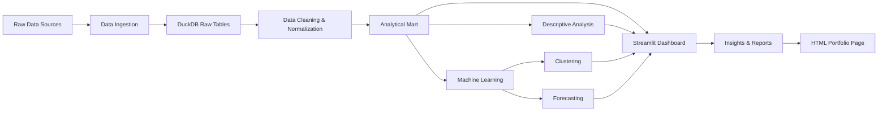

# AI Search Behavior Study

A data-driven portfolio study that analyzes the relationship between traditional web search, search engine market share, browser usage, and conversational AI assistant adoption.

## Research Questions

- Is AI assistant adoption changing traditional search behavior?
- Are search engines losing relative attention to AI tools?
- Which regions show faster AI adoption?
- Can we forecast the next 3 to 5 years of AI/search behavior?
- Are there identifiable clusters of countries, platforms or periods?
- Is the relationship between AI tools and traditional search immediate or delayed?

## Architecture



## Folder structure

- `app/` - Streamlit dashboard and page modules
- `data/` - raw, processed, and DuckDB database files
- `notebooks/` - exploratory notebooks
- `src/` - Python package for ingestion, processing, analysis, and modeling
- `portfolio_site/` - static HTML portfolio landing page
- `docs/` - project documentation
- `reports/` - methodology, findings, limitations
- `models/` - saved model artifacts
- `tests/` - pytest test cases
- `.github/workflows/` - GitHub Actions configuration

## Data sources

- Google Trends via `pytrends` or manual CSV import
- StatCounter GlobalStats search engine market share CSV
- StatCounter GlobalStats browser market share CSV
- Similarweb manual CSV for AI traffic
- Manual events dataset
- Synthetic demo data for initial development

## Installation

```bash
cd ai_search_behavior_study
python -m pip install --upgrade pip
pip install -r requirements.txt
```

## Run locally

```bash
python src/data_ingestion/create_demo_data.py
python src/database/create_database.py
python src/database/load_to_duckdb.py
streamlit run app/streamlit_app.py
```

## Open HTML portfolio page

```bash
cd portfolio_site
python -m http.server 8000
```

Then visit `http://localhost:8000`.

## GitHub setup

```bash
git init
git add .
git commit -m "Initial commit - AI Search Behavior Study"
git branch -M main
git remote add origin https://github.com/YOUR_USERNAME/ai-search-behavior-study.git
git push -u origin main
```

## GitHub Pages

1. Go to the repository on GitHub.
2. Open Settings.
3. Open Pages.
4. Choose Deploy from branch.
5. Select branch `main`.
6. Select folder `/portfolio_site`.
7. Save.
8. Open the generated link.

## Streamlit Community Cloud

1. Push the project to GitHub.
2. Sign in to Streamlit Community Cloud.
3. Create a new app.
4. Select the repository.
5. Set the main file to `app/streamlit_app.py`.
6. Confirm `requirements.txt`.
7. Configure secrets if needed.
8. Deploy.

## Limitations

- Google Trends is relative data, not absolute volume.
- Similarweb-style data may require paid or manual exports.
- Correlation does not imply causation.
- Forecasts are exploratory.
- Synthetic data is for development and demonstration only.

## Author

Project by Carlos Ferreira.
