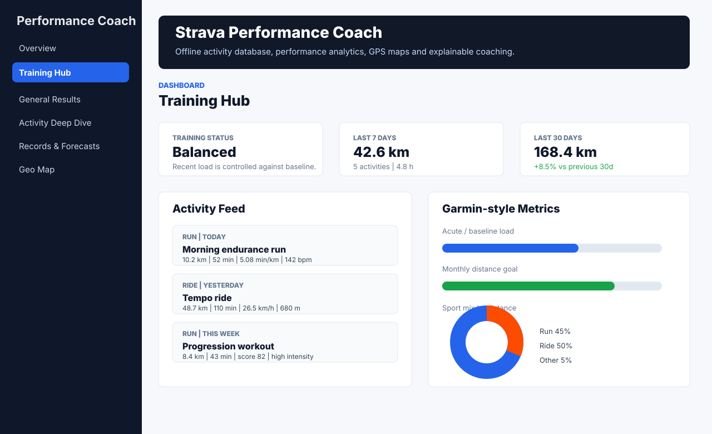
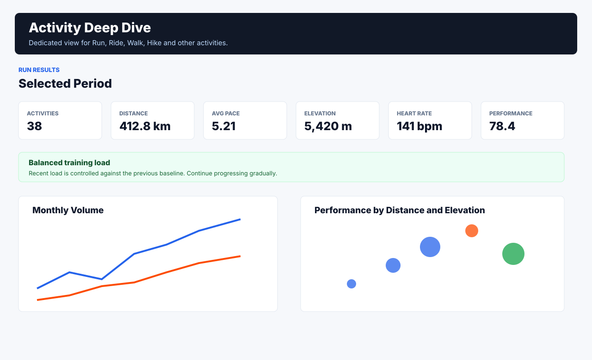
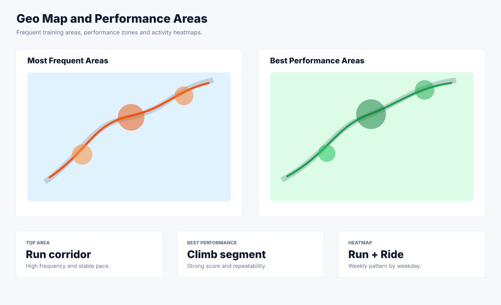

# Strava Performance Coach

Offline performance dashboard for endurance activities, built with Streamlit, DuckDB, Pandas and Plotly.

The app imports Strava export files or individual activity files, stores everything locally, and provides a professional dashboard inspired by useful patterns from Strava and Garmin Connect: activity feed, training status, load indicators, goals, records, maps, heatmaps, trends and forecasts.

No Strava OAuth button is required in the current version. The recommended workflow is local and private: download your activities, upload them in the app, import only new entries, and analyze your performance from the dedicated DuckDB database.

## Snapshots

These snapshots are sanitized product views and do not contain personal activity data.







## Main Features

- Offline-first Streamlit dashboard.
- Dedicated local DuckDB database.
- Upload support for Strava exports and individual activity files.
- Supported uploads: `.zip`, `.gpx`, `.fit`, `.tcx`, `.gz` and `.git` when the content is FIT-compatible.
- Daily update flow with duplicate detection through `Import only new activities`.
- Automatic cleanup of temporary upload files.
- Training Hub combining:
  - Strava-style activity feed and PR board.
  - Garmin-style training status, load, recovery indicators and monthly goals.
- General results page with chronological filtering.
- Activity-specific deep dive for Run, Ride, Walk, Hike, Swim and Workout.
- Personal records and 6-month trend forecasts.
- GPS route detail, elevation, speed, pace and heart rate charts.
- Geo area analysis for most frequent areas and best performance zones.
- Run and Ride heatmaps.
- Statistical analysis with distributions, percentiles, correlations and outliers.
- Coach recommendations generated from local analytics.

## Current Dashboard Pages

| Page | Purpose |
| --- | --- |
| `Overview` | Executive summary, current-year projection and high-level trends. |
| `Training Hub` | Hybrid Strava/Garmin-style home page with feed, training load, goals, PR board and sport mix. |
| `General Results` | Full analysis for the selected timeline and activity filters. |
| `Activity Deep Dive` | Dedicated dashboard for one activity type. |
| `Records & Forecasts` | Personal records, trend lines and 6-month forecasts. |
| `Timeline` | Yearly and monthly evolution with year-over-year variation. |
| `Statistics` | Statistical indicators, distributions and correlation matrix. |
| `Geo Map` | Frequent GPS areas and best performance areas. |
| `Heatmaps` | Run and Ride weekly activity heatmaps. |
| `Activities` | Individual activity detail with route, elevation, pace, speed and HR. |
| `Profile` | Athlete profile and activity profile. |
| `Coach` | Pending coaching recommendations. |

## Training Load Status

The app includes a training status indicator in `Training Hub`, `General Results` and `Activity Deep Dive`.

Possible statuses:

- `Balanced`: recent load is controlled against the baseline.
- `Elevated load`: training is productive but demanding.
- `Potentially excessive`: acute load and supporting signals suggest too much stress.
- `Low recent load`: recent training is below the baseline.
- `Needs more history`: more weeks of data are required for a useful comparison.

The status compares the last 7 days with the previous 4-week weekly baseline and combines signals such as training load, performance, average heart rate, intensity, recovery and fatigue impact.

This is an analytical aid, not medical advice.

## Technology Stack

| Layer | Technology |
| --- | --- |
| App | Streamlit |
| Database | DuckDB |
| Data processing | Pandas |
| Charts | Plotly |
| Activity parsing | GPX, TCX, FIT and Strava export importers |
| Analytics | Local Python metrics and rule-based coaching |
| Tests | Pytest and Streamlit testing |

## Project Structure

```text
strava-performance-coach/
├── app/
│   └── streamlit_app.py
├── config/
│   └── settings.py
├── database/
│   ├── schema.sql
│   └── strava_coach.duckdb          # local, gitignored
├── docs/
│   ├── manual_dashboard_upload.html # full user manual
│   └── snapshots/
├── scripts/
│   └── import_strava_export.py
├── src/
│   ├── coach/
│   ├── database/
│   ├── metrics/
│   └── processing/
└── tests/
```

## Installation

```bash
cd /Users/carlosferreira/Projecto/strava-performance-coach
python3 -m venv .venv
source .venv/bin/activate
pip install --upgrade pip
pip install -r requirements.txt
```

Optional Streamlit reload helper:

```bash
pip install watchdog
```

## Configuration

Create or update `.env` in the project root:

```bash
DUCKDB_PATH=database/strava_coach.duckdb
RAW_DATA_DIR=data/raw
```

Keep `.env`, tokens, databases and raw activity files out of Git.

## Run the App

```bash
streamlit run app/streamlit_app.py --server.port 8501
```

Open:

```text
http://localhost:8501
```

Headless mode:

```bash
streamlit run app/streamlit_app.py \
  --server.headless true \
  --server.port 8501 \
  --browser.gatherUsageStats false
```

## Upload and Daily Update Workflow

1. Download a Strava export or a single activity file.
2. Open the app.
3. In the sidebar, use `Upload Activities`.
4. Select `.zip`, `.gpx`, `.fit`, `.tcx`, `.gz` or `.git`.
5. For a single activity file, select the activity type.
6. Keep `Import only new activities` enabled.
7. Click `Import Uploaded File`.
8. Review `Training Hub`, `General Results`, `Activity Deep Dive` and `Records & Forecasts`.

Typical import result:

```text
loaded=1, skipped=0, failed=0, streams=3256, metrics=711, recommendations=11
```

## Command Line Import

Import a full Strava export without opening the app:

```bash
python3 scripts/import_strava_export.py /path/to/export.zip --only-new
```

Reprocess everything from the export:

```bash
python3 scripts/import_strava_export.py /path/to/export.zip
```

## Validation

Compile the app:

```bash
python3 -m py_compile app/streamlit_app.py
```

Run the Streamlit smoke test:

```bash
python3 - <<'PY'
from streamlit.testing.v1 import AppTest

app = AppTest.from_file("app/streamlit_app.py", default_timeout=60)
for page in ["Overview", "Training Hub", "General Results", "Activity Deep Dive"]:
    if page == "Overview":
        app.run()
    else:
        app.radio[0].set_value(page).run()
    print(page, "exception_count=", len(app.exception))
    for exc in app.exception:
        print(exc.value)
PY
```

Check the local server:

```bash
curl -I http://localhost:8501
```

Expected:

```text
HTTP/1.1 200 OK
```

## Documentation

- Full HTML manual: [docs/manual_dashboard_upload.html](docs/manual_dashboard_upload.html)
- Architecture: [docs/architecture.md](docs/architecture.md)
- Data model: [docs/data_model.md](docs/data_model.md)
- Metrics: [docs/metrics.md](docs/metrics.md)
- Coach logic: [docs/coach_logic.md](docs/coach_logic.md)

## Privacy and Security

- Activity data stays local.
- DuckDB database is gitignored.
- `.env` and token folders are gitignored.
- Uploaded files are temporary and removed after import.
- Sanitized snapshots are used in this README to avoid exposing personal routes, activity names or health metrics.

## Troubleshooting

### `ModuleNotFoundError: No module named 'config'`

Run Streamlit from the project root:

```bash
cd /Users/carlosferreira/Projecto/strava-performance-coach
streamlit run app/streamlit_app.py
```

### Port 8501 Is Already in Use

Use another port:

```bash
streamlit run app/streamlit_app.py --server.port 8502
```

Or stop the existing process:

```bash
lsof -ti tcp:8501
kill <pid>
```

### GPS Map Is Empty

Some exports only include summary metrics. Use `.gpx`, `.fit`, `.tcx` or a full export that includes streams/routes.

### Activities Are Missing

Check the sidebar filters:

- Years
- Months
- Date range
- Activity types

## Disclaimer

The dashboard provides informational training analysis only. It is not medical advice. If you feel persistent fatigue, pain, dizziness or unusual symptoms, prioritize rest and professional guidance.
